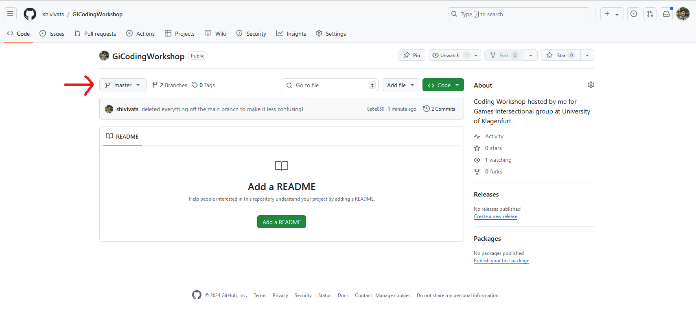
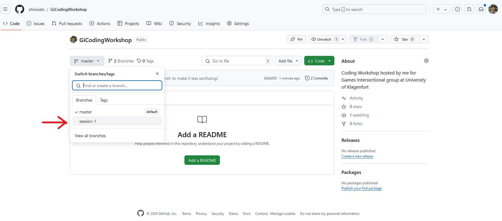

# Games Intersectional Coding Workshop

**Note:** Check out the "session-1" branch (or click on the code link) if you are new here!

## Session 1 (06.08.2024)

[Code](https://github.com/shivivats/GiCodingWorkshop/tree/session-1)

Introduction to programming with Python.\
Made a number guessing game in Python.

---
### How do I find the "session-1" or any other branch?

1. Click on the "master" branch on the home page of the repository, as shown below.

2. Click on the desired branch name to go to that session's code.

